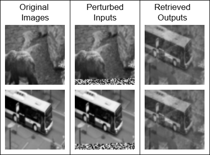

# Dense Associative Memory testing

This repository contains experimentation on dense associative memory modules, based on the
theory proposed by [Krotov and Hopfield](https://arxiv.org/abs/2008.06996).

Traditional Hopfield network, Dense Associative network and spherical memory have been implemented
incontext of image retension and retrieval. The goal here is to analyze how good are these memory
modules at learning complex patterns.

## Binary images.
All three of these networks were able to learn binary images easily with perfect recall during inference.

## Complex images.
Only dense associative network and spherical memory is tested on `64x64` RGB images.

Both architectures fail to retrieve the proper image during the inference. This points towards the possibility that the memory landspace has
collapsed into a single metastable state. This would cause the model to output a mean of all the stored patterns no matter what the input pattern is.
